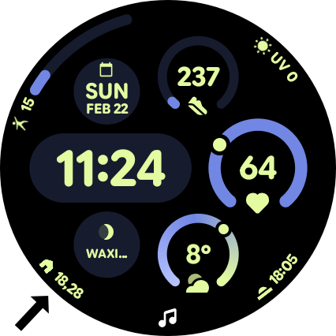
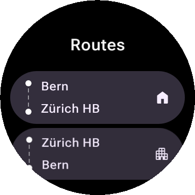

# 🚂 Perron

**Next departures on your wrist.** A Wear OS app and complication for Swiss public transport departures.

<p align="center">
  
  
</p>

## Features

- 📍 **Location-aware** — Automatically finds the closest station
- ⏱️ **Live departures** — Next 2 departure times right on your watch face
- 🔄 **Auto-refresh** — Updates every 10 minutes
- 🛤️ **Route management** — Search stations, save routes with custom icons
- 🔀 **Flexible modes** — Auto-select nearest station or cycle through saved routes
- 👆 **Tap to cycle** — Tap the complication to switch between routes
- 🇨🇭 **Swiss transport data** — Powered by [transport.opendata.ch](https://transport.opendata.ch/)

## Setup

1. Install on your Wear OS device
2. Add the **Perron** complication to your watch face
3. Open the app to search stations and save your routes
4. Grant location permission for nearest-station detection

## Permissions

| Permission | Purpose |
|---|---|
| Location | Detect nearest station |
| Internet | Fetch departure data |

## Build

```bash
./gradlew installDebug
```

## License

Apache 2.0
